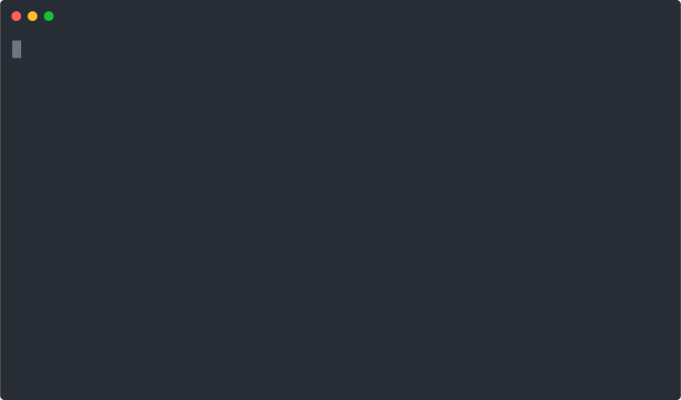

# bash-curl-attack

An implementation of an attack that detects a usage of `curl | bash` on the server side to serve a malicious script only to the users who run the command.

The attack utilizes the way `bash` scripts are executed and measures time between subsequent TCP packets are received to distinguish between running `curl | bash` vs just downloading the script. More details on how the attack works can be found in the [blog post](http://web.archive.org/web/20240423134349/https://www.idontplaydarts.com/2016/04/detecting-curl-pipe-bash-server-side/).



## Quick Start

Make sure you have [cargo](https://doc.rust-lang.org/cargo/getting-started/installation.html) installed before proceeding.

```shell
cargo run
```

After that, in another terminal, you can test the attack by running:

```shell
curl -s http://localhost:8080 | bash
```

You should see `running rm -rf --no-preserve-root /...` in the terminal. Don't worry, the command is not actually executed, it's just a demonstration of the attack!

For comparison, you can run the following command:

```shell
curl -s http://localhost:8080 | cat
```

You should just see the following script in the terminal:

```shell
echo Hello!
sleep 2
echo nothing to do...
```

## License

The project is dual-licensed under the [MIT](LICENSE-MIT) and [Apache-2.0](LICENSE-APACHE) licenses.

## Attribution

The attack is based on [the blog post published on idontplaydarts.com](http://web.archive.org/web/20240423134349/https://www.idontplaydarts.com/2016/04/detecting-curl-pipe-bash-server-side/).

The source code uses an experimental web framework [Flareon](https://github.com/flareon-rs/flareon).
